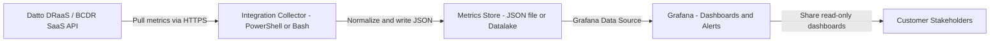
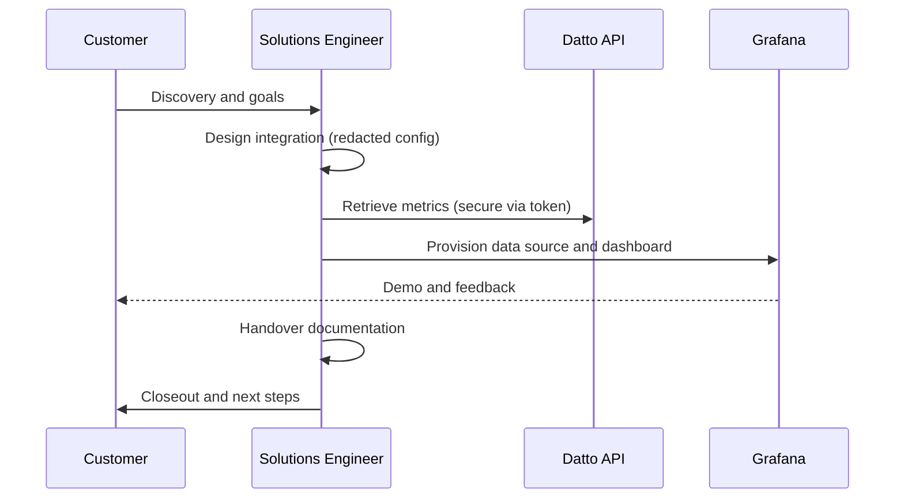

# Grafana × Datto DRaaS/BCDR Pre-Sales Demo 📊🛡️


> **Redaction Statement:**  
> This repository intentionally contains **no secrets, no IP addresses, no hostnames, and no tenant-identifying information**.  
> All values are placeholders (e.g., `<DATTO_API_KEY>`, `<CUSTOMER_TENANT>`) and must be substituted securely at runtime (environment variables or secret manager).

---

## 🎯 Purpose

A **production-ready** documentation repo for a **pre-sales activity** showing a Datto customer how **Grafana** visualizes DRaaS and BCDR backup insights securely and clearly.  
This project walks through the full lifecycle — from **discovery** to **demo handover** — while remaining fully redacted and safe to publish.

---

## 🧱 Architecture (High Level)



---

## 🔁 Lifecycle Stages



**Lifecycle Checklist**
- **Discovery** → identify personas, use cases, and success criteria  
- **Design** → define architecture, data flow, security approach  
- **Build** → create collector scripts, data sources, dashboards  
- **Test** → validate data integrity and access  
- **Demo** → guided walkthrough of metrics and insights  
- **Handover** → share documentation and runbook  
- **Closeout** → gather feedback and propose next steps  

---

## 🚀 Getting Started (Safe Demo)

1. Clone the repository:
   ```bash
   git clone https://github.com/berkeleyo/datto-grafana-presales.git
   cd datto-grafana-presales
   ```

2. Set environment variables (never hardcode secrets):
   ```bash
   export DATTO_API_BASE_URL="https://api.datto.example"
   export DATTO_API_KEY="<redacted>"
   export GRAFANA_URL="https://grafana.example"
   export GRAFANA_API_TOKEN="<redacted>"
   ```

3. Run the collector:
   ```bash
   pwsh -File ./scripts/Get-DattoBcdrMetrics.ps1 -OutFile ./metrics.json
   ```

4. Push metrics to Grafana:
   ```bash
   bash ./scripts/push_metrics_to_grafana.sh ./metrics.json
   ```

5. Review the dashboard and follow the [RUNBOOK.md](RUNBOOK.md) for demo guidance.

---

## 📂 Repository Structure

```
.
├── README.md
├── RUNBOOK.md
├── docs/
│   ├── OVERVIEW.md
│   ├── ARCHITECTURE.md
│   ├── CUTOVER_CHECKLIST.md
│   ├── ROLLBACK.md
│   └── SECURITY.md
└── scripts/
    ├── Get-DattoBcdrMetrics.ps1
    ├── push_metrics_to_grafana.sh
    ├── grafana-dashboard.json
    └── grafana-datasource.json
```

---

## ✅ Quality and Compliance

- ✅ No secrets, IPs, or tenant identifiers  
- 🔐 All credentials managed via environment variables  
- 🧩 Redaction badge confirms compliance  
- 🧰 Idempotent and demo-safe scripts  
- 📄 Documentation aligned with enterprise handover standards  

---

> Example lineage (for context):  
> “Microsoft Form → SharePoint → Power Automate → Entra ID → Conditional Access”  
> replaced with  
> **“Datto DRaaS / BCDR → Integration Collector → Grafana”** for this pre-sales showcase.
