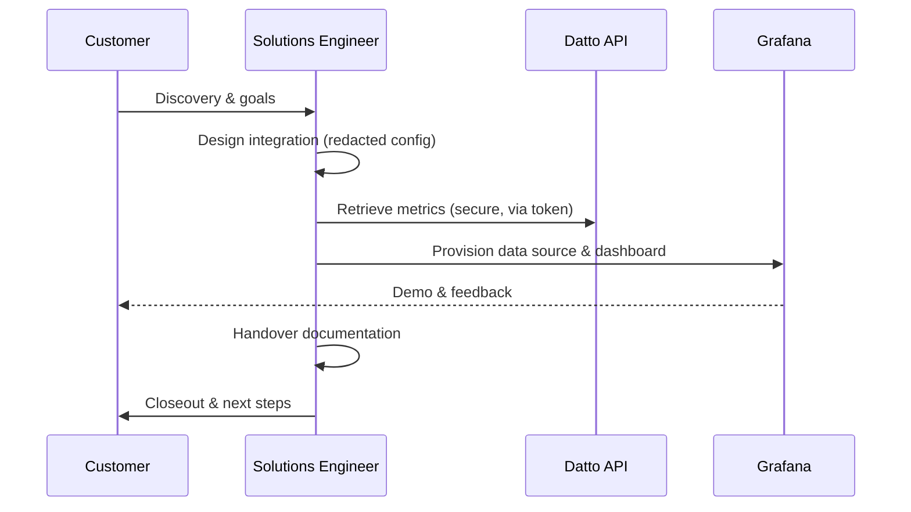

# Grafana × Datto DRaaS/BCDR Pre-Sales Demo 📊🛡️


> **Redaction Statement:**  
> This repository intentionally contains **no secrets, no IP addresses, no hostnames, and no tenant-identifying information**.  
> All values are placeholders (e.g., `<DATTO_API_KEY>`, `<CUSTOMER_TENANT>`) and MUST be substituted securely at run time via environment variables or a secret manager.

---

## 🎯 Purpose

A **clean, production-ready** repository documenting a real **pre-sales activity** — showing a Datto customer how **Grafana** can visualize backup and recovery insights from the **Datto DRaaS/BCDR SaaS** platform.

This project covers the lifecycle end-to-end — from **discovery through demo** — without leaking sensitive data.

---

## 🧱 Architecture (High Level)

```mermaid
flowchart LR
    A["Datto DRaaS / BCDR SaaS<br/>(Cloud API)"]
    B["Integration Collector<br/>(PowerShell / Bash)"]
    C["Metrics Store<br/>(Local JSON or Data Lake)"]
    D["Grafana<br/>(Dashboard & Alerts)"]
    E["Customer Stakeholders"]

    A -->|Pull metrics (HTTPS)| B
    B -->|Normalize & write JSON| C
    C -->|Grafana Data Source| D
    D -->|Share read-only| E
```

---

## 🔁 Lifecycle Stages



**Lifecycle Checklist**
- **Discovery** → target personas, success criteria, use cases  
- **Design** → architecture, data model, refresh cadence, security  
- **Build** → scripts, data source, dashboards, alerts  
- **Test** → sample data, alert dry-runs, access checks  
- **Demo** → curated walkthrough, scenario narration  
- **Handover** → docs + runbook + cleanup  
- **Closeout** → decisions, risks, next steps  

---

## 🚀 Getting Started (Safe Demo)

1. Clone the repository:
   ```bash
   git clone https://github.com/berkeleyo/datto-grafana-presales.git
   cd datto-grafana-presales
   ```

2. Export environment variables (never hardcode):
   ```bash
   export DATTO_API_BASE_URL="https://api.datto.example"
   export DATTO_API_KEY="<redacted>"
   export GRAFANA_URL="https://grafana.example"
   export GRAFANA_API_TOKEN="<redacted>"
   ```

3. Run the collector:
   ```bash
   pwsh -File ./scripts/Get-DattoBcdrMetrics.ps1 -OutFile ./metrics.json
   ```

4. Push metrics to Grafana:
   ```bash
   bash ./scripts/push_metrics_to_grafana.sh ./metrics.json
   ```

5. Follow the [RUNBOOK.md](RUNBOOK.md) for demo flow and validation.

---

## 📂 Repository Structure

```
.
├── README.md
├── RUNBOOK.md
├── docs/
│   ├── OVERVIEW.md
│   ├── ARCHITECTURE.md
│   ├── CUTOVER_CHECKLIST.md
│   ├── ROLLBACK.md
│   └── SECURITY.md
└── scripts/
    ├── Get-DattoBcdrMetrics.ps1
    ├── push_metrics_to_grafana.sh
    ├── grafana-dashboard.json
    └── grafana-datasource.json
```

---

## ✅ Quality & Compliance

- ✅ No secrets, IPs, or tenant identifiers  
- 🔐 Environment variables used for all credentials  
- 🧩 Redaction badge + internal validation  
- 🧰 Idempotent, demo-safe scripts  
- 🗂️ Documentation aligned with enterprise handover standards  

---

> Example lineage (for context only):  
> “Microsoft Form → SharePoint → Power Automate → Entra ID → Conditional Access”  
> has been replaced with  
> **“Datto DRaaS / BCDR → Integration Collector → Grafana”** for this pre-sales showcase.
