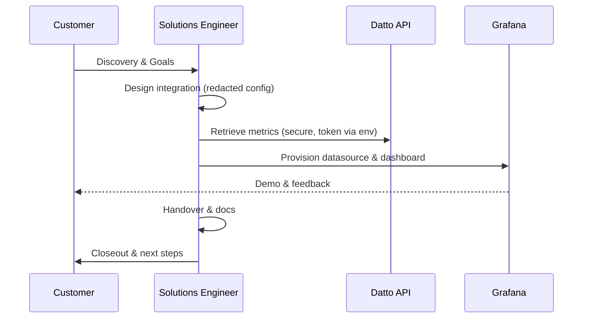

# Grafana × Datto DRaaS/BCDR Pre‑Sales Demo 📊🛡️


> **Redaction Statement:** This repository intentionally contains **no secrets, no IP addresses, no hostnames, and no tenant-identifying information**. All values are placeholders (e.g., `<DATTO_API_KEY>`, `<CUSTOMER_TENANT>`) and MUST be substituted securely at run time (environment variables or secret manager).

## 🎯 Purpose

A **clean, production-ready** repo you can `git init` and push, documenting a real **pre-sales activity**: showing a Datto customer how **Grafana** can visualize backups/BCDR status and trends from the **Datto DRaaS/BCDR SaaS** tool.

This repo covers the lifecycle end-to-end—from discovery through demo—without leaking sensitive details.

## 🧱 Architecture (high level)

```mermaid
flowchart LR
    A[Datto DRaaS/BCDR SaaS
(Cloud API)] -->|pull metrics (HTTPS)| B[Integration Collector
(PowerShell/Bash)]
    B -->|normalize & write JSON| C[Metrics Store
(local JSON file or Datalake)]
    C -->|Grafana Data Source| D[Grafana
(Dashboard & Alerts)]
    D -->|share read-only| E[Customer Stakeholders]
```

### 🔁 Lifecycle Stages



**Stages checklist**
- **Discovery** → target personas, success criteria, use cases
- **Design** → architecture, data model, refresh cadence, security
- **Build** → scripts, datasource, dashboards, alerts
- **Test** → sample data load, alert dry-runs, access checks
- **Demo** → curated walkthrough, scenario narrations
- **Handover** → runbook + docs + cleanup guidance
- **Closeout** → decisions, risks, and recommended next steps

## 🚀 Getting Started (safe demo)

1. Clone this repo and `cd` into it.
2. Populate environment variables (no hardcoded values):
   - `DATTO_API_BASE_URL` (e.g., `https://api.datto.example`)
   - `DATTO_API_KEY` (secure token) **Do not commit.**
   - `GRAFANA_URL` (e.g., `https://grafana.example`)
   - `GRAFANA_API_TOKEN` (Grafana service account) **Do not commit.**
3. Run a mock pull to generate local JSON metrics:
   ```bash
   pwsh -File ./scripts/Get-DattoBcdrMetrics.ps1 -OutFile ./metrics.json
   ```
4. Push datasource & dashboard into Grafana:
   ```bash
   bash ./scripts/push_metrics_to_grafana.sh ./metrics.json
   ```
5. Import/verify the dashboard in Grafana and walk through the **RUNBOOK.md**.

> See `docs/ARCHITECTURE.md` and `docs/SECURITY.md` for deeper details.

## 📂 Repository Structure

```
.
├─ README.md
├─ RUNBOOK.md
├─ .gitignore
├─ docs/
│  ├─ OVERVIEW.md
│  ├─ ARCHITECTURE.md
│  ├─ CUTOVER_CHECKLIST.md
│  ├─ ROLLBACK.md
│  └─ SECURITY.md
└─ scripts/
   ├─ Get-DattoBcdrMetrics.ps1
   ├─ push_metrics_to_grafana.sh
   ├─ grafana-dashboard.json
   └─ grafana-datasource.json
```

## ✅ Quality & Redaction

- **No** secrets, tenants, IPs, or org identifiers.
- All configuration via **environment variables** or secret manager.
- Scripts are **idempotent** where practical and **read-only by default**.
- Copy/paste ready for a real pre-sales walkthrough.

---

> Example pattern adapted: “Microsoft Form → SharePoint → Power Automate → Entra ID → Conditional Access (time-bound access)” — replaced with **Datto DRaaS/BCDR → Integration Collector → Grafana** for this demo.
